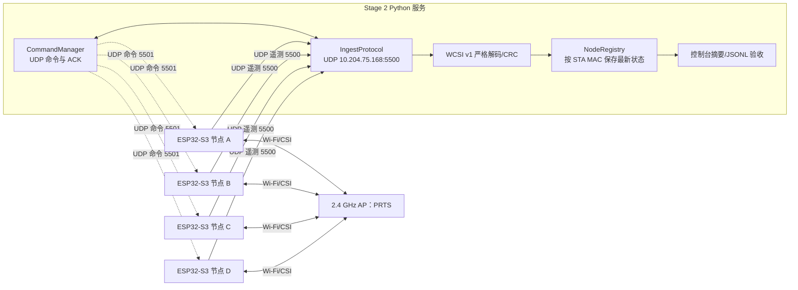
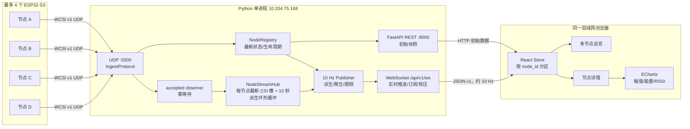
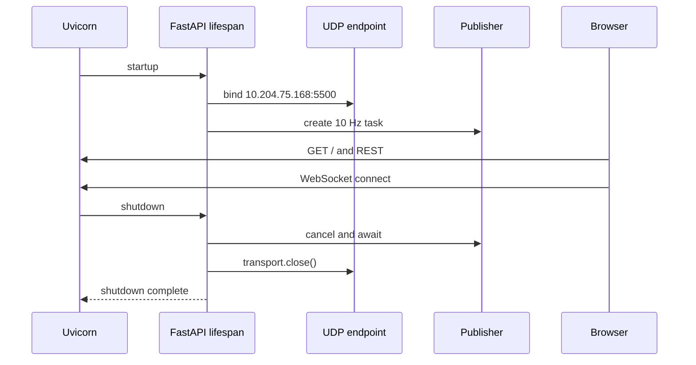
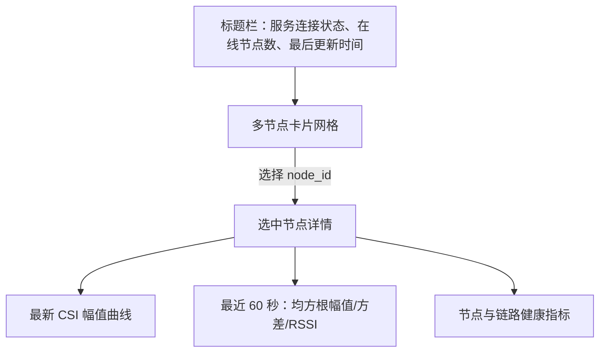

# Stage 3：多节点 CSI 与存在状态 Web 看板详细设计开发指引

- 文档日期：2026-08-16
- 基线分支：`codex/stage2-node-server-link`
- 基线提交：`dad196b`
- 目标运行环境：Windows 感知服务器 `10.204.75.168`，Python 3.12/3.13，局域网 `PRTS`
- 目标硬件：最多 4 个 ESP32-S3-N8R8 节点
- 文档性质：基于 Stage 2 的二次开发设计、接口契约、实施顺序与验收指南

> 本文只实现一个目标：在同一局域网的浏览器中查看多个 ESP32-S3 节点的实时 CSI 图表和官方 ACTIVE/INACTIVE 存在感知状态。

## 1. 目标、边界与完成定义

### 1.1 最终用户体验

打开 `http://10.204.75.168:8000` 后，网页应当：

1. 自动列出服务器已发现的全部 ESP32-S3 节点，以 STA MAC 作为稳定节点 ID；
2. 为每个节点显示在线状态、有人/无人状态、RSSI、CSI 速率和链路健康信息；
3. 选择任一节点后，实时显示该节点最新 CSI 幅值曲线，以及最近 60 秒的 CSI 能量和 RSSI 趋势；
4. 多节点数据严格隔离，不把一个节点的 CSI 或状态显示到另一个节点；
5. 节点断线后显示“离线”，节点刚上线但尚无有效感知结果时显示“初始化中”；
6. 浏览器刷新后自动恢复节点列表和实时订阅；
7. 页面关闭、刷新或渲染变慢时，不影响服务器继续接收 UDP CSI 数据。

### 1.2 明确不做

本阶段不实现：

- 历史数据库、文件持久化、CSI 录制、下载、回放或标注；
- 运动检测、跌倒检测、模型推理、自训练或第三方识别模型；
- 用户登录、权限、TLS、互联网访问、云部署、路由器端口映射；
- 节点命名、房间管理、告警、消息通知；
- 通过网页修改灵敏度、重置基线或发送其他控制命令；
- 对静止人体、多人、房间边界或准确率作超出官方 ACTIVE/INACTIVE 能力的承诺。

Stage 2 已有 UDP 命令通道继续保留，但本 Web MVP 不把它暴露为 HTTP 接口。这样可以避免把“查看看板”扩展为“远程设备管理”。

### 1.3 状态语义必须固定

| Stage 2 生命周期 | Web API `presence` | 中文显示 | 颜色建议 | 含义 |
| --- | --- | --- | --- | --- |
| `ACTIVE` | `PRESENT` | 有人 | 红/橙 | 官方活动检测为 ACTIVE，作为 MVP“有人”代理结果 |
| `INACTIVE` | `ABSENT` | 无人 | 绿 | 官方活动检测为 INACTIVE，作为 MVP“无人”代理结果 |
| `INITIALIZING` | `UNKNOWN` | 初始化中 | 黄 | 节点在线，但尚无可用稳定状态 |
| `OFFLINE` | `OFFLINE` | 离线 | 灰 | 超过 5 秒没有合法数据报 |

禁止把 `INITIALIZING` 或 `OFFLINE` 显示为“无人”。ACTIVE/INACTIVE 是活动代理结果，不等同于经过准确率验证的静态人体存在检测。

## 2. Stage 2 已实现的底座

### 2.1 当前运行链路



固件无需为 Web 阶段修改。每个节点当前会发送：

| WCSI 消息 | 典型频率 | Stage 2 服务端结果 | Web 阶段用途 |
| --- | ---: | --- | --- |
| `HELLO` | 上线、重连、每 30 秒 | 固件版本、能力、AP BSSID、命令端口 | 节点详情和重发现 |
| `CSI_FRAME` | 实测约 100 帧/秒 | 保存最新 `CsiFrame`，统计消息数 | CSI 幅值、能量、RSSI、速率 |
| `SENSING_STATE` | 约 1 秒快照及事件 | 更新 ACTIVE/INACTIVE 生命周期 | 有人/无人状态 |
| `HEARTBEAT` | 1 秒 | 堆内存、队列丢弃、UDP 错误 | 健康指标 |
| `COMMAND_ACK` | 仅收到命令后 | 完成命令事务并保存最新 ACK | 本 Web MVP 不使用 |

Stage 2 已在一块 COM8 真板上通过 638.91 秒无串口参与验收，接收 63,997 个 CSI 帧、44 个 ACTIVE 和 587 个 INACTIVE 状态，协议解析错误和设备 CSI 队列丢弃均为 0。代码结构支持按 MAC 保存多个节点，但四块真板同时运行尚未验收，因此多节点验证仍是本阶段必做项。

### 2.2 可直接复用的 Python 接口

#### `wificsi.protocol`

文件：`server/wificsi/protocol.py`

- `decode_packet(data: bytes) -> Packet`：校验 magic、版本、长度、CRC、枚举和最大 1200 字节限制；
- `Packet.header.node_id: bytes`：6 字节 STA MAC，是节点主键；
- `Packet.header.boot_id: int`：节点每次启动生成的新 ID；
- `CsiFrame.iq: bytes`：有符号 I/Q 原始字节；
- `CsiFrame.rssi`、`channel`、`first_word_invalid`：绘图和诊断需要的元数据；
- `SensingState.stable_state`：`ACTIVE`、`INACTIVE` 或 `UNKNOWN`；
- `Heartbeat`：设备队列丢弃、UDP 发送错误和堆内存信息。

二次开发规则：浏览器 API 不复制、修改或重新解释 WCSI 二进制协议。UDP 层始终先调用 Stage 2 的严格解码器，只有通过校验的数据才允许进入 Web 数据流。

#### `wificsi.registry.NodeRegistry`

文件：`server/wificsi/registry.py`

```python
registry.accept(packet, endpoint) -> bool
registry.get(node_id: bytes) -> NodeSnapshot | None
registry.list() -> tuple[NodeSnapshot, ...]
registry.expire() -> tuple[bytes, ...]
```

`NodeSnapshot` 已包含：

- `node_id`、最近 UDP `endpoint`、当前 `boot_id`；
- `lifecycle`：`OFFLINE/INITIALIZING/ACTIVE/INACTIVE`；
- `last_seen`：服务器单调时钟；
- 最新 `hello/csi/sensing/heartbeat/last_ack`；
- 接收包数、序列缺口、重复包、乱序包；
- 各 WCSI 消息类型累计数。

注册表已经按 `node_id` 字典分流并返回不可变快照，是 REST 节点列表和状态 API 的唯一事实来源。不要在 Web 层再维护第二份节点在线状态机。

需要注意：Stage 2 注册表只保存“最新一帧 CSI”，不保存 CSI 序列。这适合状态查询，但不足以直接绘制连续曲线。因此 Web 阶段应新增一个有界、仅内存的 `NodeStreamHub`，而不是把历史列表塞进 `NodeRegistry`。

#### `wificsi.ingest.IngestProtocol`

文件：`server/wificsi/ingest.py`

当前处理顺序是：

1. `decode_packet` 严格解码；
2. 将 ACK 交给 `CommandManager`；
3. `registry.accept` 更新节点；
4. 统计合法 CSI 长度；
5. 捕获并分类协议错误，确保坏包不会终止 UDP 接收循环。

Web 二次开发只需在第 3 步返回 `True` 后增加一个同步、零等待的观察回调：

```python
AcceptedPacketObserver = Callable[[Packet, tuple[str, int], float], None]
```

回调必须只执行 O(1) 的“替换最新值/设置事件”操作，不进行 JSON 编码、不访问磁盘、不等待 WebSocket、不直接运行 ECharts 数据变换。回调抛出的异常必须被隔离并计数，不能影响 UDP ingest。

#### `wificsi.commands.CommandManager`

文件：`server/wificsi/commands.py`

Stage 2 已有 GET_CONFIG、RESET_BASELINE、SET_CONFIG、关联 ID、0/0.5/1.0 秒重试和 ACK 匹配。本 Web MVP 不调用这些接口。后续若确需控制功能，应另写设计和权限边界，不能在节点详情组件中顺手加入按钮。

#### `wificsi.server`

文件：`server/wificsi/server.py`

当前 `run_server()` 创建注册表、UDP endpoint、命令管理器并循环打印摘要/可选 JSONL。Web 阶段不要让 CLI 服务和 Web 服务各绑定一次 UDP 5500；应提取一个可组合运行时，使同一进程、同一 `NodeRegistry` 同时服务 UDP、REST 和 WebSocket。

### 2.3 Stage 2 代码二次开发原则

1. 保持 `protocol.py` 和固件 WCSI v1 不变；Web 数据格式是独立的 JSON v1；
2. 保持 `NodeRegistry` 负责节点生命周期，不把 WebSocket 客户端状态放入注册表；
3. 新增 accepted-packet observer，而不是从 UDP 旁路重新解析数据；
4. 保留现有 `wificsi-server` CLI 和 Stage 2 验收工具，新增 `wificsi-dashboard` 入口；
5. 新依赖只放在 Web 运行组，Stage 2 核心测试仍应快速运行；
6. 所有内存容器必须有固定上限，网页消费慢时丢弃旧的“显示帧”，绝不阻塞 UDP 接收；
7. 节点身份始终使用规范化小写 MAC，例如 `28:84:85:87:2b:f4`，不要使用 IP 作为节点 ID。

## 3. 推荐目标架构

### 3.1 技术栈

- 后端：现有 Python 3.12/3.13 + `asyncio` + FastAPI + Uvicorn；
- JSON 模型：Pydantic（由 FastAPI 使用）；
- 前端：React + TypeScript + Vite；
- 图表：Apache ECharts；
- 测试：pytest、FastAPI TestClient、Vitest、React Testing Library、Playwright（仅最终浏览器验收可选）。

选择 FastAPI 是因为现有服务本身就是 asyncio UDP 服务，可以在同一事件循环中运行，并直接支持 WebSocket。Vite 用于开发服务器和生产构建；ECharts 的 `setOption` 增量更新适合实时曲线。参考官方文档：[FastAPI WebSocket](https://fastapi.tiangolo.com/advanced/websockets/)、[Vite 指南](https://vite.dev/guide/)、[ECharts 动态数据](https://echarts.apache.org/handbook/en/how-to/data/dynamic-data/)。

不推荐在本阶段使用 Node.js 后端、Redis、MQTT、Kafka、InfluxDB 或 Grafana：它们会复制 Stage 2 的 UDP/注册表逻辑，增加部署进程和数据边界，却不为 4 节点局域网实时查看提供必要价值。

### 3.2 完整数据流



### 3.3 进程和端口

| 用途 | 地址 | 协议 | 说明 |
| --- | --- | --- | --- |
| 节点遥测 | `10.204.75.168:5500` | UDP | 保持 Stage 2 不变 |
| 节点命令 | 每个节点 `:5501` | UDP | Stage 2 保留，本 Web MVP 不调用 |
| Web/API | `10.204.75.168:8000` | HTTP/WebSocket | 浏览器入口和 API |
| Vite 开发服务 | `127.0.0.1:5173` | HTTP | 仅开发期；代理 `/api` 到 8000 |

生产/验收时由 FastAPI 在同一端口提供 `web/dist` 静态文件、REST 和 WebSocket，因此无需 CORS。开发期 Vite 使用代理，也无需把后端改成允许任意来源。

## 4. 服务器内部详细设计

### 4.1 建议目录

```text
server/wificsi/
├── protocol.py                 # Stage 2：不改
├── registry.py                 # Stage 2：生命周期事实来源
├── ingest.py                   # 增加 accepted observer
├── commands.py                 # Stage 2：本阶段不改行为
├── server.py                   # 保留 headless CLI
└── web/
    ├── __init__.py
    ├── settings.py             # UDP/HTTP 地址、发布频率和容量上限
    ├── models.py               # REST/WS Pydantic JSON v1 模型
    ├── transform.py            # I/Q -> 幅值、能量等纯函数
    ├── stream.py               # NodeStreamHub 与有界内存
    ├── connections.py          # WS 订阅和合并式邮箱
    ├── api.py                  # REST 路由、WebSocket 路由
    ├── runtime.py              # UDP endpoint、registry、hub、publisher 生命周期
    └── main.py                 # wificsi-dashboard CLI/Uvicorn 入口

web/
├── package.json
├── vite.config.ts
├── tsconfig.json
├── index.html
└── src/
    ├── api/contracts.ts        # 与 JSON v1 对齐的 TypeScript 类型
    ├── api/http.ts             # REST 客户端
    ├── api/socket.ts           # 重连、订阅、消息校验
    ├── state/dashboard.ts      # reducer/store，按 node_id 隔离
    ├── components/NodeCard.tsx
    ├── components/NodeGrid.tsx
    ├── components/PresenceBadge.tsx
    ├── components/CsiAmplitudeChart.tsx
    ├── components/SignalHistoryChart.tsx
    ├── pages/DashboardPage.tsx
    ├── App.tsx
    └── main.tsx
```

不要把全部后端写入一个 `app.py`，也不要把 WebSocket、ECharts option 和节点状态都写入一个 React 组件。上述边界使协议、派生算法、传输、状态管理和展示可分别测试。

### 4.2 `NodeStreamHub`：有界实时数据层

`NodeRegistry` 保留最新权威状态；`NodeStreamHub` 只为实时展示服务。建议接口：

```python
@dataclass(frozen=True, slots=True)
class DerivedCsiSample:
    node_id: bytes
    boot_id: int
    server_time_ms: int
    device_time_us: int
    rssi: int
    channel: int
    first_word_invalid: bool
    amplitude: tuple[float, ...]
    mean_amplitude: float
    rms_amplitude: float
    variance: float
    source_frames: int
    ui_frames_coalesced: int

class NodeStreamHub:
    def offer(self, packet: Packet, received_at: float) -> None: ...
    def flush_latest(self, now: float) -> tuple[DerivedCsiSample, ...]: ...
    def recent(self, node_id: bytes) -> tuple[DerivedCsiSample, ...]: ...
    def reset_boot(self, node_id: bytes, boot_id: int) -> None: ...
```

建议实现方式：

- 每个节点只有一个 `latest_raw_csi` 槽；新的合法 CSI 覆盖旧值，并累计 `source_frames`；
- publisher 每 100 ms 调用一次 `flush_latest`，此时才执行 I/Q 派生计算；
- 每节点保存最近 10 秒、最多 100 个 `DerivedCsiSample`；只在内存中保存，进程退出即丢失；
- 若某 100 ms 周期没有新 CSI，则不制造重复 CSI 点；状态仍由 1 Hz `node_status` 更新；
- `boot_id` 改变时清空该节点派生缓冲，避免把重启前后数据画成一条连续曲线；
- 可配置上限固定为 16 个节点，虽然当前验收目标是 4 个；超过上限时拒绝创建新流并增加内部指标，而不是无限增长。

这种“最新值合并”策略意味着 Web 图表不会展示每个约 100 Hz 原始帧，但会稳定展示约 10 Hz 的实时代表帧。原始 UDP 帧仍全部由 Stage 2 解码和计数；只有 UI 展示帧被主动限频。

### 4.3 CSI 派生算法

Stage 2 传入 `CsiFrame.iq` 是二进制补码字节。按照 ESP-IDF CSI 数据约定，每个复数采样对按虚部、实部排列。实现时先将字节解释为 `int8`，再计算幅值：

```python
import math
import struct

def iq_to_amplitude(iq: bytes, first_word_invalid: bool) -> tuple[float, ...]:
    values = struct.unpack(f"{len(iq)}b", iq)
    start = 4 if first_word_invalid and len(values) >= 4 else 0
    usable = values[start:]
    if len(usable) % 2:
        usable = usable[:-1]
    return tuple(
        math.hypot(usable[index + 1], usable[index])
        for index in range(0, len(usable), 2)
    )
```

约束：

- `first_word_invalid=True` 时忽略最前 4 个原始字节，但不改 Stage 2 线上数据；
- 奇数长度防御性丢弃最后 1 字节，同时增加 transform 错误计数；正常 WCSI 数据应为偶数；
- 横轴命名为“复数采样对索引”，不要直接标成子载波频率；不同带宽/CSI 配置下索引到物理子载波的映射需单独解析；
- 幅值为 `sqrt(real² + imag²)`；
- `mean_amplitude = mean(amplitude)`；
- `rms_amplitude = sqrt(mean(amplitude²))`；
- `variance = mean((x - mean)²)`；
- 不做归一化、滤波、模型推理或人体状态二次判定。有人/无人只来自 `SENSING_STATE`。

为避免算法误读，必须添加固定 I/Q 测试，例如 `iq=bytes([3,4,0,5])` 应得到幅值 `(5.0, 5.0)`；`first_word_invalid=True` 的测试应确认前 4 字节被忽略。

### 4.4 Publisher 和背压

publisher 是一个固定 10 Hz 的 asyncio task：

1. 调用 `registry.expire()` 更新离线状态；
2. 从 `NodeStreamHub.flush_latest()` 取本周期各节点最新派生 CSI；
3. 将 CSI 转为 `csi_batch`；
4. 每秒或生命周期变化时从 `NodeRegistry.list()` 生成 `node_status`；
5. 通过 `ConnectionManager.publish()` 非阻塞投递。

禁止为每个约 100 Hz UDP CSI 帧直接 `json.dumps` 并 WebSocket 广播。4 个节点时这会产生大量短消息和 React 重渲染，也会让慢浏览器拖累 UDP 事件循环。

每个 WebSocket 连接使用“按 `(event_type, node_id)` 合并”的邮箱，而不是无界队列：

```python
class ClientMailbox:
    # 最多保存：1 个 nodes_snapshot + 每个订阅节点 1 个 node_status + 1 个 csi_batch
    def offer_latest(self, key: tuple[str, str], event: dict) -> None: ...
    async def next_event(self) -> dict: ...
```

如果旧 `csi_batch` 尚未发送，新批次直接覆盖旧批次并增加 `client_frames_coalesced`。状态消息也保留最新值。`offer_latest` 不允许 `await`，所以慢浏览器不会反压 UDP ingest。连接关闭后必须移除邮箱和 sender task。

### 4.5 应用生命周期

建议让 FastAPI lifespan 统一拥有资源：



`wificsi-dashboard` 应默认：

```text
UDP host  = 10.204.75.168
UDP port  = 5500
HTTP host = 10.204.75.168
HTTP port = 8000
publish   = 10 Hz
offline   = 5 s（复用 NodeRegistry）
```

同时允许 CLI 参数覆盖，便于测试绑定 `127.0.0.1` 和随机端口。不要把服务器地址硬编码进 React 源码；前端使用相对 URL 和 `window.location.host`。

## 5. HTTP API v1 契约

所有响应使用 UTF-8 JSON；MAC 为小写冒号格式；时间戳为 Unix epoch 毫秒；单调时钟不直接暴露给浏览器。路径固定带 `/api/v1`，未来修改字段语义时增加版本，不静默改变 v1。

### 5.1 `GET /api/v1/health`

用途：确认进程、UDP 绑定和 publisher 正常，不代表节点在线。

```json
{
  "status": "ok",
  "server_time_ms": 1786890000123,
  "udp_bound": true,
  "udp_endpoint": "10.204.75.168:5500",
  "publisher_hz": 10,
  "known_nodes": 4,
  "online_nodes": 3
}
```

### 5.2 `GET /api/v1/nodes`

用途：页面首次加载和 WebSocket 重连后的权威全量节点快照。

```json
{
  "schema_version": 1,
  "server_time_ms": 1786890000123,
  "nodes": [
    {
      "node_id": "28:84:85:87:2b:f4",
      "boot_id": 305419896,
      "lifecycle": "ACTIVE",
      "presence": "PRESENT",
      "presence_label": "有人",
      "last_seen_age_ms": 37,
      "firmware": "1.0.0",
      "ap_bssid": "5e:e3:88:d9:5b:42",
      "channel": 4,
      "rssi_dbm": -43,
      "csi_rate_hz": 99.8,
      "accepted_packets": 123456,
      "sequence_gaps": 14,
      "duplicates": 0,
      "out_of_order": 1,
      "queue_dropped": 0,
      "udp_send_errors": 13,
      "free_heap_bytes": 7123456,
      "csi_available": true,
      "sensing_available": true
    }
  ]
}
```

规则：

- `last_seen_age_ms` 在生成响应时由当前单调时钟减 `NodeSnapshot.last_seen` 计算；
- 缺少 HELLO/CSI/HEARTBEAT 时，相应字段返回 `null` 或 `false`，不能填 0 冒充测量值；
- OFFLINE 节点仍保留在列表中，直到服务进程重启；
- 列表按 `node_id` 排序，保证 UI 稳定；
- `csi_rate_hz` 使用最近完整 1 秒窗口的源 CSI 数，不使用 Web 10 Hz 输出帧数。

### 5.3 `GET /api/v1/nodes/{node_id}`

返回与列表中相同的节点对象，可附加 Stage 2 最新 sensing 诊断字段，但这些字段不能产生第二套存在结论：

```json
{
  "schema_version": 1,
  "server_time_ms": 1786890000123,
  "node": { "node_id": "28:84:85:87:2b:f4", "presence": "PRESENT" },
  "sensing": {
    "stable_state": "ACTIVE",
    "process_state": "ACTIVE",
    "init_stage": "STABLE",
    "jitter": 0.112,
    "wander": 0.087,
    "reason": 0
  }
}
```

响应规则：

- 合法但未知 MAC：HTTP 404，`{"detail":{"code":"node_not_found"}}`；
- MAC 格式错误：HTTP 422，`{"detail":{"code":"invalid_node_id"}}`；
- 不返回原始 `iq` 字节。

### 5.4 `GET /api/v1/nodes/{node_id}/latest-csi`

用于页面首次打开详情时立即获得一个派生帧；后续由 WebSocket 更新。

```json
{
  "schema_version": 1,
  "node_id": "28:84:85:87:2b:f4",
  "boot_id": 305419896,
  "server_time_ms": 1786890000123,
  "device_time_us": 927345678,
  "rssi_dbm": -43,
  "channel": 4,
  "sample_pair_count": 3,
  "amplitude": [12.04, 18.38, 9.0],
  "mean_amplitude": 14.2,
  "rms_amplitude": 16.8,
  "variance": 27.1,
  "source_frames": 10,
  "ui_frames_coalesced": 9
}
```

尚无派生 CSI 时返回 HTTP 404 和 `csi_not_available`。数组实际长度由 CSI 帧决定，前端不能假设固定 64/128/192 个点。

## 6. WebSocket JSON v1 契约

### 6.1 连接和订阅

地址：`ws://10.204.75.168:8000/api/v1/ws`

连接成功后服务器首先发送 `hello` 和 `nodes_snapshot`。客户端随后发送：

```json
{
  "type": "subscribe",
  "schema_version": 1,
  "node_ids": ["28:84:85:87:2b:f4", "30:ae:a4:00:11:22"]
}
```

规则：

- `node_ids=[]` 表示订阅当前及后续发现的全部节点；
- 非空数组表示仅订阅指定节点，最多 16 个，重复项去重；
- 再次发送 `subscribe` 会原子替换旧订阅；
- 未知节点 ID 可以保留在订阅中，节点稍后出现时自动开始推送；
- 非法 JSON、未知消息类型、错误版本或非法 MAC 返回 `error`，连续 3 次协议错误后关闭连接，关闭码 1008；
- 服务器每 20 秒发送 WebSocket ping 或应用 `ping`，60 秒无响应关闭连接。

前端总览页建议订阅全部节点，而详情页仍使用同一连接，不要为每个 NodeCard 创建一个 WebSocket。

### 6.2 统一事件信封

```json
{
  "type": "node_status",
  "schema_version": 1,
  "event_id": 8123,
  "server_time_ms": 1786890000123,
  "data": {}
}
```

`event_id` 是服务器进程内递增的 uint64，仅用于客户端发现一次连接中的跳号；服务器重启后可从 1 重新开始，不提供历史补发保证。

### 6.3 `hello`

```json
{
  "type": "hello",
  "schema_version": 1,
  "event_id": 1,
  "server_time_ms": 1786890000123,
  "data": {
    "server_instance_id": "7f0f7ad7-8326-4d41-bc46-e28948834bc5",
    "publish_hz": 10,
    "offline_after_ms": 5000
  }
}
```

`server_instance_id` 改变表示后端重启。前端应清空短时图表，再通过 REST 重新拉取全量节点。

### 6.4 `nodes_snapshot`

`data` 与 `GET /api/v1/nodes` 响应一致。在连接建立、订阅成功和服务器认为客户端需要重新同步时发送，不以 10 Hz 重复发送。

### 6.5 `node_status`

每个在线节点最多 1 Hz 推送，并在生命周期/boot_id 变化时立即推送。`data` 是一个 NodeSummary。OFFLINE 事件必须在 Stage 2 五秒过期规则触发后推送。

### 6.6 `csi_batch`

每个有新数据的订阅节点最高约 10 Hz：

```json
{
  "type": "csi_batch",
  "schema_version": 1,
  "event_id": 8124,
  "server_time_ms": 1786890000223,
  "data": {
    "node_id": "28:84:85:87:2b:f4",
    "boot_id": 305419896,
    "device_time_us": 927345678,
    "rssi_dbm": -43,
    "channel": 4,
    "amplitude": [12.04, 18.38, 9.0],
    "mean_amplitude": 14.2,
    "rms_amplitude": 16.8,
    "variance": 27.1,
    "source_frames": 10,
    "ui_frames_coalesced": 9
  }
}
```

不要发送 base64 原始 IQ，也不要一次批量包含 100 个完整幅值数组。`source_frames` 表示本 UI 周期观察到多少个源 CSI 帧；`ui_frames_coalesced` 表示其中有多少帧被最新值策略替换，便于确认这是主动 UI 限频而非设备/UDP 丢包。

### 6.7 `error`

```json
{
  "type": "error",
  "schema_version": 1,
  "event_id": 8125,
  "server_time_ms": 1786890000300,
  "data": {
    "code": "invalid_subscription",
    "message": "node_ids must contain at most 16 valid MAC addresses"
  }
}
```

错误信息不得包含 Python traceback、局域网凭据或原始 UDP 数据。

## 7. 前端详细设计

### 7.1 页面布局



桌面端建议上方总览、下方详情；窄屏改为单列。首版不需要路由系统，单页 `DashboardPage` 即可。

### 7.2 节点卡片

每张卡必须显示：

- 节点 ID（完整 MAC，允许视觉上突出末两字节）；
- “有人/无人/初始化中/离线”徽标；
- RSSI dBm、CSI 源速率 Hz；
- 最后数据年龄；
- 设备队列丢弃、UDP 发送错误、服务器序列缺口；
- 当前选中状态。

卡片排序：在线在前，随后按 `node_id`；不要按状态频繁重排，避免卡片跳动。可实现为“首次按在线分组、组内稳定 MAC 排序”。

### 7.3 节点详情图表

1. **最新 CSI 幅值曲线**
   - x 轴：复数采样对索引；
   - y 轴：幅值；
   - 每个 `csi_batch` 替换整条曲线；
   - 使用固定 ECharts 实例和 `setOption`，不要每帧销毁/重建；
   - `animation: false`，减少 10 Hz 更新拖影。

2. **最近 60 秒趋势**
   - x 轴：浏览器接收时间；
   - 三条可切换序列：RMS 幅值、方差、RSSI；
   - 每节点每序列最多 600 点；新增后删除最旧点；
   - 浏览器刷新后历史为空是预期行为，不从服务器/磁盘补历史。

3. **状态和健康**
   - 明确显示 ACTIVE/INACTIVE 原始枚举和中文映射；
   - 显示 `boot_id`，变化时清空该节点图表；
   - 显示队列丢弃、UDP 错误、序列 gaps/duplicates/out_of_order；
   - 非零计数用警示色，但不要自动解释为存在检测失败。

### 7.4 前端状态模型

建议 reducer 状态：

```typescript
type DashboardState = {
  connection: "CONNECTING" | "OPEN" | "RETRYING" | "CLOSED";
  serverInstanceId: string | null;
  nodes: Record<string, NodeSummary>;
  streams: Record<string, {
    bootId: number;
    latest: CsiBatch | null;
    history: SignalPoint[];
  }>;
  selectedNodeId: string | null;
};
```

更新规则：

- 所有键先将 MAC 规范化为小写冒号格式；
- `nodes_snapshot` 替换节点快照，但保留同一 `boot_id` 的短时曲线；
- `node_status` 只更新对应节点；
- `csi_batch` 的 `boot_id` 与缓存不同则先清空该节点历史；
- 每个节点历史最多 600 点，不能用一个全局数组混放；
- 当前选择节点离线时保持选择并显示离线，不自动跳到其他节点；
- 首次发现节点且尚未选择时，自动选择排序后的第一个在线节点。

### 7.5 WebSocket 重连

客户端重连退避建议为 1、2、4、8 秒，之后固定 10 秒；浏览器恢复可见或网络变为 online 时立即尝试一次。每次连接恢复：

1. 等待 `hello`；
2. 比较 `server_instance_id`；若变化则清空所有短时图表；
3. 发送当前订阅；
4. 调用 `GET /api/v1/nodes` 做权威重同步；
5. 恢复实时事件处理。

前端可显示“连接中/重连中”，但后端断开时不得把所有节点立即标成“无人”；可在 WebSocket 断开后显示“服务器连接中断”，节点卡的最后已知状态加“过期”遮罩。

### 7.6 Vite 开发代理

开发期 `vite.config.ts`：

```typescript
export default defineConfig({
  plugins: [react()],
  server: {
    host: "127.0.0.1",
    port: 5173,
    proxy: {
      "/api": {
        target: "http://10.204.75.168:8000",
        ws: true,
      },
    },
  },
});
```

前端请求只使用 `/api/v1/...`，WebSocket URL 根据当前页面协议生成：HTTP 对应 `ws:`，HTTPS 对应 `wss:`。本阶段局域网使用 HTTP/WS。

## 8. 分步开发实施计划

以下任务按顺序完成。每个任务都必须先写失败测试，再做最小实现，再运行全量测试并提交。不要把所有功能一次写完后再联调。

### Task 1：冻结 JSON v1 模型和纯转换函数

**创建/修改文件**

- 修改 `pyproject.toml`：增加 FastAPI、Uvicorn 的受控版本范围和 Web 测试依赖；
- 创建 `server/wificsi/web/models.py`；
- 创建 `server/wificsi/web/transform.py`；
- 创建 `tests/server/web/test_models.py`；
- 创建 `tests/server/web/test_transform.py`。

**实施步骤**

1. 为四种 lifecycle 到 presence 的映射写参数化失败测试；
2. 为 MAC 编码、可空字段、NaN/Infinity 拒绝和 JSON 字段名写失败测试；
3. 为 I/Q 幅值、invalid first word、可变长度、奇数长度防御写失败测试；
4. 实现纯函数和 Pydantic 模型，不依赖 FastAPI app；
5. 运行：

```powershell
D:\Develop\uv\uv.exe run pytest tests/server/web/test_models.py tests/server/web/test_transform.py -v
D:\Develop\uv\uv.exe run pytest -q
```

**完成标准**

- ACTIVE/INACTIVE/INITIALIZING/OFFLINE 映射无歧义；
- 固定 I/Q 向量结果准确；
- JSON 不允许非有限浮点值；
- Stage 2 全部测试保持通过。

建议提交：`feat: define web telemetry contracts`

### Task 2：增加 accepted observer 和有界 `NodeStreamHub`

**创建/修改文件**

- 修改 `server/wificsi/ingest.py`；
- 创建 `server/wificsi/web/stream.py`；
- 修改/扩展 `tests/server/test_ingest_simulator.py`；
- 创建 `tests/server/web/test_stream.py`。

**实施步骤**

1. 写测试证明只有 `registry.accept(...) == True` 的合法新包会通知 observer；
2. 写测试证明坏 CRC、重复包、旧包不会进入 stream；
3. 写测试证明 observer 异常只增加 `observer_errors`，后续合法 UDP 包仍被接收；
4. 写测试证明同节点高频 CSI 只覆盖 latest slot，`source_frames` 正确累计；
5. 写测试证明不同 MAC 的 slot/ring 独立；
6. 写测试证明 boot_id 变化清空该节点 ring；
7. 写测试证明每节点 ring 最多 100 点、节点最多 16 个，长时间输入内存不增长；
8. 实现同步 `offer` 和 10 Hz `flush_latest`；
9. 运行 focused 和全量 pytest。

**完成标准**

- UDP 回调路径没有 await、磁盘 I/O 或 JSON 编码；
- 1000 个突发 CSI 输入后只保留最新 raw slot 和固定容量派生 ring；
- 多节点不会串流；
- Stage 2 ingest 行为不回归。

建议提交：`feat: add bounded realtime CSI stream hub`

### Task 3：组合 UDP 运行时和 REST API

**创建/修改文件**

- 创建 `server/wificsi/web/settings.py`；
- 创建 `server/wificsi/web/runtime.py`；
- 创建 `server/wificsi/web/api.py`；
- 创建 `server/wificsi/web/main.py`；
- 修改 `pyproject.toml` 增加 `wificsi-dashboard`；
- 创建 `tests/server/web/test_api.py`；
- 创建 `tests/server/web/test_runtime.py`。

**实施步骤**

1. 用依赖注入的 fake clock/registry 写 `/health`、`/nodes`、`/nodes/{id}`、`/latest-csi` 失败测试；
2. 覆盖未知节点 404、错误 MAC 422、可空遥测字段和 OFFLINE 映射；
3. 写 lifespan 测试，确认启动只绑定一个 UDP endpoint，关闭时 transport 和 task 都结束；
4. 实现 `DashboardRuntime`，持有 `registry/ingest/transport/hub/manager`；
5. 实现只读 REST 路由；
6. 保持 `wificsi-server` 旧入口可运行，新增：

```powershell
D:\Develop\uv\uv.exe run wificsi-dashboard `
  --udp-host 10.204.75.168 --udp-port 5500 `
  --http-host 10.204.75.168 --http-port 8000
```

7. 用 simulator 启动一个节点，使用浏览器或 `Invoke-RestMethod` 确认节点出现。

**完成标准**

- 一个进程只有一个 UDP 5500 监听者；
- REST 返回模拟节点和真板节点快照；
- HTTP API 不返回 raw IQ；
- Ctrl+C 后 UDP 端口和 8000 端口均释放。

建议提交：`feat: expose read-only node REST API`

### Task 4：WebSocket、订阅和慢客户端背压

**创建/修改文件**

- 创建 `server/wificsi/web/connections.py`；
- 扩展 `server/wificsi/web/api.py` 和 `runtime.py`；
- 创建 `tests/server/web/test_websocket.py`；
- 创建 `tests/server/web/test_backpressure.py`。

**实施步骤**

1. 写连接后收到 `hello`、`nodes_snapshot` 的失败测试；
2. 写全部节点订阅、指定节点订阅、替换订阅和未知节点后出现的测试；
3. 写非法消息和关闭码 1008 测试；
4. 写 10 Hz fake clock 测试，确保 100 Hz 源输入不会产生 100 Hz WebSocket 消息；
5. 写慢客户端测试：停止读取 2 秒，UDP ingest 仍继续，邮箱尺寸保持 `O(订阅节点数)`，恢复后收到最新而不是旧积压；
6. 写连接释放测试，确认 sender task 和 mailbox 都移除；
7. 实现 publisher、ConnectionManager 和 ClientMailbox；
8. 使用两个模拟节点验证订阅隔离。

**完成标准**

- 每节点 CSI 推送最高约 10 Hz；
- 慢客户端不会阻塞 UDP ingest；
- 客户端断开不会泄漏 task/队列；
- 节点 OFFLINE/boot 变化能及时推送。

建议提交：`feat: stream bounded multi-node telemetry over websocket`

### Task 5：搭建 React 页面和多节点总览

**创建/修改文件**

- 创建 `web/` Vite React TypeScript 工程；
- 创建 `web/src/api/contracts.ts`、`http.ts`、`socket.ts`；
- 创建 `web/src/state/dashboard.ts`；
- 创建 PresenceBadge、NodeCard、NodeGrid 和 DashboardPage；
- 创建对应 Vitest/Testing Library 测试。

**实施步骤**

1. 使用 `npm create vite@latest web -- --template react-ts`，随后审查生成文件并删除演示内容；
2. 安装 ECharts、Vitest、jsdom 和 Testing Library；锁定 `package-lock.json`；
3. 从本文 JSON v1 手工定义 TypeScript discriminated union，禁止使用 `any`；
4. 写 reducer 测试：snapshot、单节点更新、多节点隔离、boot 清空、600 点上限；
5. 写 NodeCard 四种状态渲染测试，确认 OFFLINE/INITIALIZING 不显示“无人”；
6. 实现 REST 首次加载、单 WebSocket 连接和重连状态；
7. 实现响应式卡片网格、连接状态和选中节点；
8. 运行：

```powershell
Set-Location web
npm test -- --run
npm run build
```

**完成标准**

- 2～4 个模拟节点都显示独立卡片；
- 状态映射正确；
- 页面只建立一个 WebSocket；
- 无 TypeScript 错误，生产构建成功。

建议提交：`feat: add multi-node presence overview`

### Task 6：实现 CSI 与信号图表

**创建/修改文件**

- 创建 `CsiAmplitudeChart.tsx`、`SignalHistoryChart.tsx`；
- 扩展 DashboardPage 和前端状态测试；
- 添加图表 option 纯函数测试。

**实施步骤**

1. 将 ECharts option 构造提取为纯函数并写测试；
2. 测试可变幅值数组长度，禁止固定子载波数量；
3. 测试每节点 600 点历史上限和切换节点不串图；
4. 使用 `ref` 创建一次 ECharts 实例，用 `setOption` 更新，组件卸载时 `dispose()`；
5. 关闭幅值曲线动画，趋势图只追加/裁剪数据；
6. 窗口 resize 时调用 chart resize；
7. 无 CSI、初始化、离线和 WebSocket 断开分别显示清晰空状态；
8. 用真实 COM8 节点确认幅值曲线持续更新，状态和 RSSI 同步变化。

**完成标准**

- 页面可持续显示 10 Hz 图表，无明显冻结；
- 切换节点时图表数据与 MAC 一致；
- 连续 30 分钟后浏览器历史仍为固定 600 点/节点；
- 刷新页面不要求恢复旧趋势。

建议提交：`feat: visualize realtime CSI and signal trends`

### Task 7：生产静态托管、多节点联调和正式验收

**创建/修改文件**

- 修改 FastAPI app，在 `web/dist` 存在时托管静态文件；
- 添加 `README.md` Web 启动章节；
- 创建 `docs/verification/stage3-web-dashboard.md`；
- 添加端到端多节点模拟测试和最终启动脚本。

**实施步骤**

1. `npm run build` 生成 `web/dist`；确定是构建时生成而非提交，或明确团队策略后提交；推荐不提交 dist；
2. FastAPI 最后挂载 SPA 静态路由，确保 `/api/v1/*` 不被 index.html 吞掉；
3. 自动启动 4 个不同 MAC/boot_id 的 simulator，运行 10 分钟；
4. 验证每个节点都有 HELLO/CSI/SENSING/HEARTBEAT，且页面/API/WS 的 node_id 一致；
5. 让一个模拟节点停止超过 5 秒，确认仅该节点变 OFFLINE；恢复后变 INITIALIZING，再随状态变 ACTIVE/INACTIVE；
6. 人为暂停一个 WebSocket 客户端读取，确认 UDP 和另一个客户端正常；
7. 依次烧录并记录其余 3 块真板 STA MAC；先单板冒烟，再 2 板并发，最后 4 板并发至少 30 分钟；
8. 记录页面截图、API 示例、节点 MAC、CSI 速率、状态变化、内存和错误计数；不记录 raw IQ；
9. 运行完整后端和前端测试并生成 Stage 3 验收报告。

**完成标准**

- 使用浏览器访问 `http://10.204.75.168:8000` 即可工作，不需要 Vite 开发服务器；
- 4 个模拟节点必须通过；4 块真板是最终目标验收；
- 任何一个节点断线、重启或状态变化不影响其他节点；
- 30 分钟内后端和浏览器内存保持有界；
- 没有原始 CSI 文件、数据库或录制功能。

建议提交：`docs: verify multi-node web dashboard`

## 9. 测试矩阵

### 9.1 后端自动测试

| 类别 | 必测条件 |
| --- | --- |
| 转换 | 正/负 int8、已知幅值、first word invalid、可变长度、非有限值拒绝 |
| 映射 | 四种 lifecycle，不把 UNKNOWN/OFFLINE 当 ABSENT |
| ingest observer | 合法新包通知；坏包、重复、旧包不通知；observer 异常隔离 |
| stream | 最新槽覆盖、源帧计数、10 秒/100 点上限、boot 清空、16 节点上限 |
| REST | 空注册表、1/4 节点、缺字段、404、422、离线、排序 |
| WebSocket | hello、snapshot、全订阅、选择订阅、替换订阅、非法消息、断开清理 |
| 背压 | 100 Hz 源→约 10 Hz 输出；慢客户端邮箱有界；UDP 不停止 |
| runtime | 启停、端口释放、Ctrl+C 清理、服务器重启后节点自动发现 |
| 回归 | Stage 2 85 项测试全部通过 |

### 9.2 前端自动测试

| 类别 | 必测条件 |
| --- | --- |
| contracts | 每种事件判别、非法事件拒绝或忽略且记录 |
| reducer | snapshot、增量状态、CSI、boot 变化、多节点隔离、600 点裁剪 |
| UI | 四种状态文案、无 CSI 空态、服务断连遮罩、稳定选择 |
| socket | URL 构造、退避、重订阅、server instance 变化重置 |
| charts | 可变长度幅值、禁用动画、实例 dispose、节点切换 |
| build | `npm test -- --run`、`npm run build` 均成功 |

### 9.3 真实系统验收标准

| 指标 | 通过条件 |
| --- | --- |
| 节点发现 | 每个已启动节点在 35 秒内出现在页面 |
| 多节点 | 4 个唯一 MAC 同时显示；数据、状态、健康计数不串节点 |
| 页面刷新率 | CSI 图表目标 10 Hz，最低持续 5 Hz |
| 状态延迟 | 收到 SENSING_STATE 后 2 秒内显示对应状态 |
| 离线判定 | 最后合法包后约 5～6 秒显示离线 |
| 浏览器恢复 | 刷新或 WebSocket 中断后自动重连、重订阅和 REST 重同步 |
| 服务重启 | 节点无需串口/复位，周期 HELLO 后重新出现在网页，目标 35 秒内 |
| 背压 | 慢/隐藏页面不阻塞 UDP ingest，其他浏览器仍正常 |
| 内存 | 4 节点连续 30 分钟，ring/history 数量不超设计上限，无持续线性增长 |
| 数据边界 | 无数据库、无 raw IQ 文件、无录制/下载 API |

“页面看起来在动”不能替代以上验收。必须同时检查服务器 `queue_dropped`、`udp_send_errors`、`sequence_gaps`、`duplicates`、`out_of_order`，并区分设备丢弃、UDP 链路问题和 UI 主动合并。

## 10. 开发和运行操作手册

### 10.1 后端开发环境

```powershell
Set-Location D:\Projects\Codex\WIFICSI
D:\Develop\uv\uv.exe sync --all-groups
D:\Develop\uv\uv.exe run pytest -q
```

实现 Web 依赖后，启动：

```powershell
D:\Develop\uv\uv.exe run wificsi-dashboard `
  --udp-host 10.204.75.168 `
  --udp-port 5500 `
  --http-host 10.204.75.168 `
  --http-port 8000
```

如果启动时报 `Address already in use`，先用只读命令查明占用者，不要同时运行旧 `wificsi-server` 和新 dashboard：

```powershell
Get-NetUDPEndpoint -LocalPort 5500 -ErrorAction SilentlyContinue
Get-NetTCPConnection -LocalPort 8000 -ErrorAction SilentlyContinue
```

### 10.2 前端开发环境

```powershell
Set-Location D:\Projects\Codex\WIFICSI\web
npm install
npm run dev
```

开发页面只在本机 `http://127.0.0.1:5173`，通过 Vite 代理访问后端。局域网验收使用 FastAPI 托管的 `http://10.204.75.168:8000`。

### 10.3 模拟节点优先联调

先使用 Stage 2 simulator 做多节点和故障场景，避免每次都占用串口。每个进程使用不同 MAC；具体 CLI 参数以 `wificsi-simulator --help` 为准。建议预留四个测试 MAC：

```text
02:00:00:00:00:01
02:00:00:00:00:02
02:00:00:00:00:03
02:00:00:00:00:04
```

验证顺序：1 节点正常流 → 4 节点并发 → 单节点停机 → 单节点新 boot 重启 → 后端重启 → 慢 WebSocket 客户端。全部通过后再接真板。

### 10.4 真板联调

1. 保持现有 COM8 已验收固件作为第一节点；
2. 逐块连接另外三块板，烧录同一生产配置，记录各自 STA MAC；
3. 每块单独确认 HELLO/CSI/SENSING/HEARTBEAT；
4. 同时上电两块，确认节点 ID、CSI 和状态不串；
5. 同时上电四块，运行 30 分钟；
6. 不打开串口监视器参与正式 headless 验收；串口只用于烧录和有界启动诊断；
7. 检查 AP 能承受流量和各节点 RSSI，记录但不要为“漂亮数字”隐藏 gaps/UDP 错误。

## 11. 常见错误和排查顺序

### 11.1 API 有节点，但图表不动

按顺序检查：

1. `message_counts.CSI_FRAME` 是否增长；
2. accepted observer 是否收到合法 `CsiFrame`；
3. hub 的 `source_frames` 是否增长；
4. publisher 是否每 100 ms flush；
5. WebSocket 是否订阅了对应 MAC；
6. reducer 是否因 boot_id/MAC 格式不一致丢弃事件；
7. ECharts 是否复用了实例并调用 `setOption`。

不要先修改固件；先定位数据在哪一层停止。

### 11.2 图表更新导致 UDP 丢包

检查 ingest observer 中是否做了幅值计算、JSON 编码或 await；检查是否每源 CSI 帧广播；检查慢客户端是否使用无界 `asyncio.Queue`。正确路径是 latest slot → 10 Hz flush → 合并式客户端邮箱。

### 11.3 节点状态错误显示为无人

只检查 `NodeSnapshot.lifecycle` 映射。不要根据 CSI 能量、RSSI、旧 sensing 字段或缺包自行推断“无人”。INITIALIZING/OFFLINE 必须分别显示。

### 11.4 多节点串数据

检查后端、WS 订阅、reducer 和 React `key` 是否全程使用同一个规范化 `node_id`；不要用数组下标、IP、UDP 源端口或卡片顺序作为身份。

### 11.5 页面运行越久越慢

检查：每节点趋势是否严格裁剪为 600 点；ECharts 是否重复 init；断开的 WebSocket sender task 是否清理；后端 ring 是否严格 100 点；客户端 mailbox 是否按 key 覆盖而非追加。

## 12. 安全和部署边界

本阶段没有认证、加密和授权，只能用于可信局域网：

- HTTP 只绑定 `10.204.75.168`，不要绑定公网网卡；
- 不设置路由器端口转发；
- Windows 防火墙只允许 PRTS 所在专用网络访问 TCP 8000 和 UDP 5500；
- 不在网页、日志或错误中输出 Wi-Fi 密码；PRTS/arknights 虽已明确为公开实验网络配置，仍不需要在 API 中返回；
- REST 和 WebSocket 均为只读；
- 若未来需要远程访问、用户登录或网页控制节点，必须重新进行安全设计，不属于本文增量。

## 13. 完成后的启动结果

开发完成后，日常使用只需：

1. 让 1～4 个 ESP32-S3 上电并连接 PRTS；
2. 在 `10.204.75.168` 上启动 `wificsi-dashboard`；
3. 任一同局域网浏览器打开 `http://10.204.75.168:8000`；
4. 页面自动显示多节点总览；点击节点查看实时 CSI 幅值和最近 60 秒信号趋势。

最终链路固定为：

```text
ESP32-S3 WCSI v1 UDP
  -> Stage 2 IngestProtocol/NodeRegistry
  -> Stage 3 NodeStreamHub 10 Hz 有界派生
  -> FastAPI REST + WebSocket JSON v1
  -> React 多节点总览 + ECharts 节点详情
```

这条链路不包含数据库、录制、标注、运动/跌倒检测、用户系统或远程访问。只要第 9.3 节验收矩阵全部通过，即可认定“网页查看多节点 CSI 数据和存在感知状态”目标完成。
