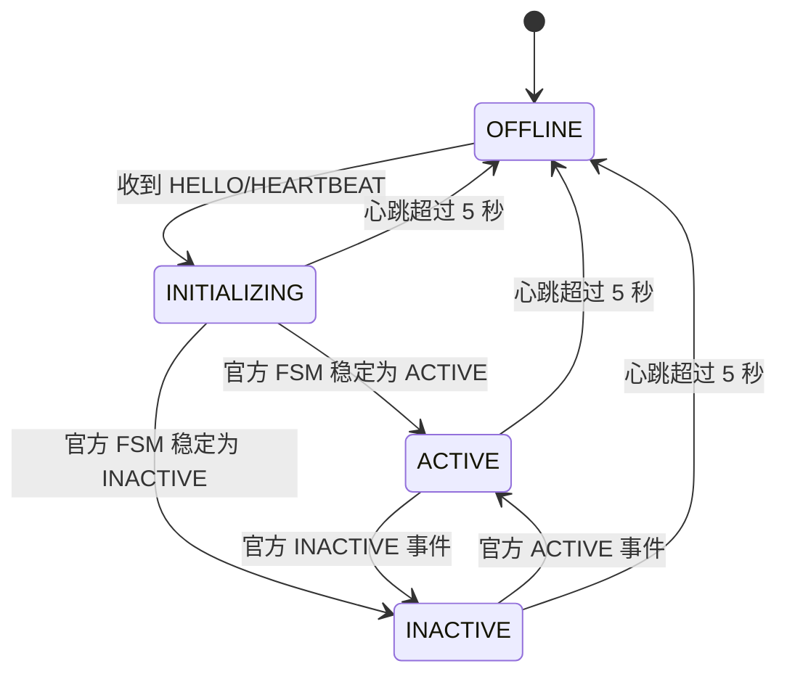

# Wi-Fi CSI 存在感知 MVP 设计规格

- 日期：2026-08-16
- 状态：已批准
- 目标硬件：4 × ESP32-S3-N8R8（首块当前连接在 COM8）
- 固件环境：ESP-IDF v5.4.4
- 网络：2.4 GHz WLAN `PRTS`
- 感知服务器：Windows，保留 IPv4 地址 `10.204.75.168`

## 1. 目标与范围

本里程碑实现一个基于真实 Wi-Fi CSI 数据的存在感知闭环：ESP32-S3 采集其与路由器之间的 CSI，使用乐鑫官方感知组件产生 `ACTIVE/INACTIVE`，将 CSI、状态和运行诊断发送到 Windows 感知服务器，再由 Web 页面展示每个节点的实时 CSI 图表与状态。

MVP 对状态作如下产品映射：

- `ACTIVE` → “有人”
- `INACTIVE` → “无人”

该映射是为了尽快完成可靠的工程闭环。它实际表达的是“检测到足够明显的信道活动”与“未检测到足够明显的信道活动”，不能证明完全静止的人体仍可被检测。页面和文档必须保留原始 `ACTIVE/INACTIVE` 字段并说明这一限制。

### 1.1 交付目标

1. 在当前硬件与网络上复现乐鑫官方 CSI 与感知方案。
2. 打通 ESP32-S3 → Python 感知服务器的局域网数据链路。
3. 在 Web 页面实时显示每个节点的 CSI 图表、状态和链路健康指标。
4. 从单个 COM8 节点逐步扩展到四个 ESP32-S3 节点，并完成稳定性与现场感知验收。

### 1.2 明确非目标

本里程碑不包含：

- 原始 CSI 长期录制、实验会话、CSV/Parquet 数据集或导出功能；
- 数据标注界面或标签协议；
- 运动分类、跌倒检测、姿态、人数、呼吸或医疗报警；
- 运动/跌倒模型的选型、训练、部署或占位接口；
- MQTT、云平台、账号登录、外网访问和移动端专项适配；
- 专用 ESP32 发射节点拓扑；
- IEEE 802.11bf 协议实现或兼容性声明。

目标 2（录制、标注、运动/跌倒检测）将在本里程碑完成并由用户确认后，另行调研和设计。目标 1 不为目标 2 预先增加功能代码。

## 2. 依据与复用策略

优先复用以下官方组件和参考实现：

- [espressif/esp-csi](https://github.com/espressif/esp-csi)：CSI 获取、路由器 Ping、原始数据解析及官方示例。
- [ESP32-S3 Wi-Fi CSI 官方文档](https://docs.espressif.com/projects/esp-idf/zh_CN/latest/esp32s3/api-guides/wifi-driver/wifi-vendor-features.html)：`wifi_csi_info_t`、CSI 配置、回调约束、LTF 与可变长度数据格式。
- [espressif/esp-radar 0.3.4](https://components.espressif.com/components/espressif/esp-radar/versions/0.3.4/readme)：CSI 感知特征、标定、诊断及多 peer 处理。
- [espressif/esp_wifi_sensing 0.1.1~2](https://components.espressif.com/components/espressif/esp_wifi_sensing/versions/0.1.1~2/readme)：动态基线、迟滞、去抖、状态机和路由器 Ping 驱动采样。
- [WaveSight](https://github.com/ErfanDL/WaveSight) 与 [ESPectre](https://github.com/francescopace/espectre)：仅借鉴现场调参、状态展示和工程组织经验，不替换官方主链路。

组件版本在实施时写入 manifest/lock 文件并固定，避免上游更新造成不可重复构建。若组件管理器解析出的兼容版本与上述调研版本不同，必须先记录差异、重新运行官方基线，再决定是否采用；不得静默升级。

RuView、空壳项目及仅含模拟数据的演示不作为算法或验收依据。页面只展示实际收到的 CSI 和实际执行的状态机结果，不生成伪造姿态、人数或动画结果。

### 2.1 IEEE 标准边界

[IEEE 802.11bf-2025](https://standards.ieee.org/ieee/802.11bf/11574/) 定义了增强 WLAN Sensing 的专门 MAC/PHY 机制。本项目使用 ESP32-S3 从 802.11n 接收包的训练字段提取 CSI，并通过乐鑫接口处理；因此只能描述为“基于 IEEE 802.11 OFDM Wi-Fi 信号的 CSI 感知”，不得宣称 ESP32-S3 实现了 802.11bf。

## 3. 总体架构

```mermaid
flowchart LR
    AP["PRTS 2.4 GHz 路由器"]

    subgraph Nodes["ESP32-S3 感知节点 × 1 → 4"]
        CSI["CSI 接收与路由器 Ping"]
        Radar["esp-radar"]
        FSM["esp_wifi_sensing FSM"]
        Queue["FreeRTOS 有界队列"]
        UDP["UDP 遥测与控制"]
        CSI --> Radar --> FSM
        CSI --> Queue --> UDP
        FSM --> Queue
    end

    subgraph Server["Windows 感知服务器 10.204.75.168"]
        Ingest["UDP 接收与协议校验 :5500"]
        Registry["节点注册表与内存环形缓冲区"]
        API["FastAPI REST + WebSocket :8000"]
        Ingest --> Registry --> API
    end

    subgraph Browser["局域网浏览器"]
        Dashboard["多节点仪表盘"]
        Charts["CSI / RSSI / jitter 实时图表"]
        State["有人/无人与运行状态"]
        Dashboard --> Charts
        Dashboard --> State
    end

    AP <-->|"Wi-Fi 数据包 / Ping"| CSI
    UDP -->|"CSI、状态、心跳"| Ingest
    Ingest -->|"低频控制命令"| UDP
    API -->|"WebSocket 实时流"| Dashboard
    Dashboard -->|"REST 查询与控制"| API
```

### 3.1 责任边界

ESP32-S3 负责采集、官方状态判定以及设备遥测。状态判断不依赖服务器或浏览器是否在线。

Python 服务器负责协议校验、节点管理、短期内存缓存、浏览器 API 和链路健康统计。它不重新实现官方存在感知算法，也不持久化原始 CSI。

浏览器只连接感知服务器，不直接连接 ESP32-S3。浏览器负责展示，不参与状态判断。

## 4. ESP32-S3 固件设计

### 4.1 启动流程

1. 初始化 NVS、网络栈和 Wi-Fi STA。
2. 连接 `PRTS` 并等待获得 IPv4 地址。
3. 获取 AP BSSID、信道及节点自身 MAC。
4. 初始化 `esp-radar` 和 `esp_wifi_sensing`，注册 AP 感知通道。
5. 注册 `ACTIVE/INACTIVE` 事件回调并启动状态机。
6. 启动官方路由器 Ping 辅助采样。
7. 启动 UDP 遥测任务、心跳任务和低频控制接收任务。
8. 发送 `HELLO`，进入 `INITIALIZING`，待官方组件完成基线初始化后发布稳定状态。

PRTS 是明确公开的实验 WLAN，其 SSID 和口令作为固件默认配置直接跟踪；
不再进行密钥提取、隐藏配置或凭据字面量扫描。服务器地址同样使用可追踪默认值。

### 4.2 CSI 数据路径

ESP-IDF 官方说明 CSI 回调运行在 Wi-Fi 任务上下文中，因此回调只完成：

- 参数和长度检查；
- 必要元数据与 CSI 缓冲区复制；
- 写入有界 FreeRTOS 队列；
- 队列满时递增设备端丢弃计数。

回调中不得执行 socket 发送、格式化大段文本、动态文件操作或阻塞等待。独立遥测任务从队列取出数据、编码 UDP 包并发送。

CSI 数据长度必须取自每帧 `wifi_csi_info_t.len`。固件和服务器不得假设固定为 192 个复数或 162 个有效子载波。若 `first_word_invalid` 为真，原始标志必须上报；可视化解析时跳过官方文档指明的无效字节。

### 4.3 状态与控制

固件上报：

- 官方 FSM 稳定状态；
- 内部初始化/去抖状态；
- jitter、平滑值、进入/退出阈值等公开诊断字段；
- RSSI、信道、采样计数、队列丢弃计数、可用内存和运行时间。

控制命令仅包含目标 1 所需能力：查询配置、触发官方现场标定、设置允许公开调整的存在感知灵敏度参数。每个命令带关联 ID，设备返回 `COMMAND_ACK` 和明确错误码。超时重试次数有上限，同一关联 ID 的命令必须幂等处理。

### 4.4 断线恢复

- Wi-Fi 断开后按有界退避策略重连，不重启整个设备。
- 服务器不可达时丢弃过期实时帧，不无限缓存。
- Wi-Fi 恢复后重新确认 AP BSSID/信道；若感知链路发生变化，重新进入 `INITIALIZING`。
- 每次设备启动生成新的 `boot_id`，服务器据此区分序号重置。

## 5. UDP 设备协议

默认端点为 `10.204.75.168:5500`。协议版本 1 的 UDP 数据报硬上限为 1200 字节，低于普通局域网 MTU，避免 IP 分片。ESP32-S3 官方最大 CSI 负载加协议头必须控制在该上限内；固件编码器和服务器解析器都执行长度检查。

### 5.1 公共头

协议版本 1 使用网络字节序和固定 40 字节公共头：

| 偏移 | 长度 | 字段 | 版本 1 取值/语义 |
| ---: | ---: | --- | --- |
| 0 | 4 | magic | ASCII `WCSI` |
| 4 | 1 | major | `1` |
| 5 | 1 | minor | `0` |
| 6 | 1 | message_type | 消息类型枚举 |
| 7 | 1 | flags | 消息级标志 |
| 8 | 2 | header_length | `40` |
| 10 | 2 | payload_length | 不含公共头的载荷长度 |
| 12 | 6 | node_id | ESP32-S3 Wi-Fi STA MAC |
| 18 | 2 | reserved | 发送方写零，接收方忽略 |
| 20 | 4 | boot_id | 每次启动生成的随机非零值 |
| 24 | 4 | sequence | 每节点、每次启动单调递增并允许回绕 |
| 28 | 8 | device_time_us | 启动后的单调微秒时间 |
| 36 | 4 | crc32 | 公共头中本字段置零后，与载荷一起计算 IEEE CRC-32 |

接收方要求 `header_length + payload_length` 等于实际 UDP 数据报长度且不超过 1200 字节。固件与 Python 使用相同测试向量锁定字段偏移、字节序和 CRC。未知主版本必须拒绝；主版本相同但次版本更高时，只允许依据 `header_length` 忽略新增头尾字段，现有字段语义不得改变。

### 5.2 消息类型

| 类型 | 方向 | 用途 |
| --- | --- | --- |
| `HELLO` | 节点 → 服务器 | 节点、固件、芯片和协议能力声明 |
| `CSI_FRAME` | 节点 → 服务器 | 可变长度原始 I/Q 与 PHY/LTF 接收元数据 |
| `SENSING_STATE` | 节点 → 服务器 | FSM 状态、诊断值和状态切换原因 |
| `HEARTBEAT` | 节点 → 服务器 | 在线状态、运行时间、内存和累计计数 |
| `COMMAND` | 服务器 → 节点 | 标定、查询和灵敏度配置 |
| `COMMAND_ACK` | 节点 → 服务器 | 关联命令的执行结果 |

UDP 不保证到达和顺序，因此：

- CSI 帧不重传，服务器通过序号统计缺口；
- 状态消息周期性重发当前快照，避免单个事件包丢失导致网页永久停留在旧状态；
- 控制命令使用关联 ID、有限重试和 ACK；
- 服务器同时记录设备报告的队列丢弃与网络序号缺口，二者不得混为一个指标。

## 6. Python 感知服务器

Python 环境使用 `uv` 创建与锁定。服务器作为一个进程运行，包含 UDP 接收、节点状态、FastAPI 和 WebSocket 推送，但模块之间使用明确接口，避免网络解析、业务状态与 Web 展示耦合。

### 6.1 核心模块

- `protocol`：二进制编解码、版本检查和测试向量。
- `ingest`：异步 UDP 接收、来源检查、解析错误统计。
- `nodes`：以节点 ID/MAC 为键的注册表、状态和健康指标。
- `buffers`：每节点短期内存环形缓冲区；进程退出即清空。
- `stream`：将高频 CSI 聚合/降采样为浏览器可消费的约 10 FPS 数据。
- `api`：REST、WebSocket、控制命令和静态资源服务。

### 6.2 节点生命周期

若 FSM 处于内部 `DEBOUNCE`，服务器保持上一次稳定的 ACTIVE/INACTIVE，并额外上报 `判定中` 标志；若没有稳定历史，则保持 `INITIALIZING`。

服务器重启后不得从浏览器缓存或旧值恢复人体状态。所有节点先显示 `OFFLINE/INITIALIZING`，直到收到本次运行的有效消息。

### 6.3 API 边界

REST 仅提供：服务健康、节点列表、单节点当前快照、公开存在感知配置、标定/配置命令。WebSocket 提供节点增删、实时状态、健康指标和降采样图表数据。

MVP 不提供数据集下载、历史查询、录制、标签和模型 API。

## 7. Web 仪表盘

FastAPI 在 `0.0.0.0:8000` 提供局域网页面。前端使用本地打包的 Apache ECharts，不依赖运行时互联网访问。

### 7.1 页面布局

顶部显示服务器运行时间、WebSocket 状态、在线节点数和全局错误。

节点概览区为每个 ESP32-S3 显示：

- 节点名称、MAC 和在线/离线；
- “有人/无人”及原始 `ACTIVE/INACTIVE`；
- `INITIALIZING`、`判定中` 或错误标志；
- RSSI、采样率、网络序号缺口率和设备队列丢弃数。

点击节点后显示：

1. CSI 幅度热力图：时间 × 子载波索引，颜色为复数幅度；
2. 信号趋势图：CSI 平均幅度或选定子载波，以及 RSSI；
3. 感知诊断图：jitter、平滑值、进入/退出阈值和状态阶梯线。

图表默认以约 10 FPS 刷新，显示最近 30 秒，并允许切换 10/30/60 秒。服务器保留更高频的短期内存数据，但不把每个原始帧完整推送到每个浏览器。

### 7.2 异常表现

- 节点断线后保留最后一屏图形但置灰，并显示最后在线时间；
- WebSocket 自动有界退避重连；
- 协议主版本不兼容的节点不进入实时流，并展示原因；
- 单个损坏或丢失的 CSI 包只增加指标，不阻塞后续数据；
- 任一节点故障不得影响其他节点；
- 页面不提供任何录制、标签、运动或跌倒相关控件。

## 8. 实施顺序与阶段门

### 阶段 1：官方基线复现

在 COM8 上复现官方路由器 CSI 与 `wifi_sensing_demo` 路径，确认 PRTS 连接、真实 CSI、ACTIVE/INACTIVE、现场标定和实际采样率。保存命令、版本、MAC、AP BSSID/信道、CSI 长度分布和观测结果。

阶段门：官方真实数据与状态机在当前环境可运行。失败时先定位官方基线，不进入定制固件。

### 阶段 2：ESP32-S3 到感知服务器

先用固定协议测试向量和 Python 设备模拟器验证服务器，再实现固件队列、UDP 遥测、心跳和有限控制命令。验证可变 CSI 长度、序号回绕、包损坏、Wi-Fi 重连、服务器不可达和服务器重启。

阶段门：单个真实节点能在无串口参与的情况下持续向服务器上报有效 CSI 与官方状态。

### 阶段 3：实时 Web 闭环

实现 FastAPI、节点注册表、内存缓冲、REST/WebSocket、单节点卡片与三类图表。验证状态语义、浏览器重连、服务器重启和端到端延迟。

阶段门：局域网浏览器能持续观察 COM8 节点的真实 CSI 与“有人/无人”。

### 阶段 4：四节点扩展

其余三块板逐块烧录、单独验证后再并入系统。所有节点使用同一固件，通过 MAC 派生唯一 ID。四节点均使用路由器 CSI；通过降低或错开 Ping 频率处理拥塞，本里程碑不改为专用发射节点。

阶段门：四节点并发稳定运行并通过隔离性、链路和现场感知验收。

## 9. 测试与验收

### 9.1 自动化测试

固件：协议编码测试、边界长度、序号回绕、队列满计数和命令幂等性；每次变更执行 ESP32-S3 完整构建。

服务器：协议正常/截断/损坏/未知版本测试，节点生命周期、5 秒离线判定、环形缓冲上限、降采样、WebSocket 快照、控制命令超时与多节点隔离测试。

集成：Python 设备模拟器生成四节点不同长度和速率的 CSI 流，验证 API、图表数据、丢包统计和单节点故障隔离；浏览器关键流程执行自动化冒烟测试。

### 9.2 单节点验收

- COM8 设备接收真实 CSI，不使用模拟、随机或预录数据；
- 上电后无需串口参与即可连接 PRTS 和服务器；
- PRTS 中其他设备能访问网页；
- 页面持续显示真实 CSI、RSSI、诊断指标和状态；
- 图表及状态端到端延迟目标不超过 1 秒；
- 设备、服务器或网页单独重启后能自动恢复；
- 节点停止心跳后 5 秒内标记离线；
- 连续运行至少 60 分钟，无崩溃、死锁或持续内存增长。

### 9.3 四节点验收

- 四块 ESP32-S3 同时在线至少 60 分钟；
- 页面正确区分四节点，不串流；
- 每节点独立显示 CSI、ACTIVE/INACTIVE、RSSI、采样率及丢包指标；
- 任意单节点断电不影响其余三个节点；
- 同时区分网络序号缺口与设备队列丢弃；
- 正常局域网条件下，每节点 CSI 数据包接收率目标不低于 95%；未达到时必须报告实测数据和定位到的瓶颈，不得隐藏或用插值伪装缺失帧。

### 9.4 现场感知验收

固定路由器与节点位置，并记录房间、距离、高度、朝向、信道、灵敏度和 Ping 频率。每节点完成：

- 不少于 20 次明显人体动作测试；
- 不少于 20 个无人静态观察窗口；
- ACTIVE 响应延迟、未触发次数和无人误触发次数统计。

本里程碑不预先承诺跨房间或跨部署准确率。验收报告必须包含完整测试条件与实测结果，并再次声明“有人/无人”是 ACTIVE/INACTIVE 的 MVP 映射。

## 10. 安全、配置与部署

- PRTS 属于公开实验 WLAN，其 SSID/口令允许作为可追踪默认值；无需按密钥处理或反复扫描；
- Web 服务仅面向 PRTS 局域网，不配置公网端口映射；
- Windows 防火墙只放行目标 UDP/TCP 端口和所需网络配置文件；
- UDP 控制命令只接受已注册节点/服务器端点和合法协议消息；MVP 不宣称对恶意同网段攻击提供完整安全防护；
- 所有端口、超时、Ping 频率和图表窗口使用显式配置并提供可追踪默认值；
- 运行文档必须包含 ESP-IDF 环境激活、固件构建/烧录、`uv` 服务启动、Windows 防火墙和局域网页面访问步骤。

## 11. 里程碑交付与停止条件

四阶段及验收完成后交付：

- ESP32-S3 固件源码与固定依赖；
- Python 感知服务器与 Web 页面；
- 二进制协议与 REST/WebSocket 接口文档；
- 单节点和四节点部署/故障排查说明；
- 自动化测试与现场验收报告；
- 已知限制和 ACTIVE/INACTIVE 状态语义说明。

达到上述条件后停止开发，不自动开始目标 2。只有用户审阅并确认目标 1 里程碑后，才重新启动录制、标注和运动/跌倒检测的开源复用调研与设计。
