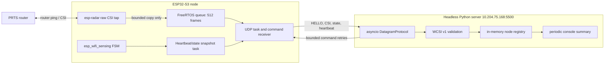

# Wi-Fi CSI Target 1 Stage 2 Node-to-Server Design

- Date: 2026-08-16
- Status: approved
- Base: Stage 1 commit `865b7bc`
- Hardware: one ESP32-S3-N8R8 on COM8
- Server: Windows host `10.204.75.168`
- Network: 2.4 GHz WLAN `PRTS`

## 1. Goal and Boundary

Stage 2 delivers a headless, observable link from one real ESP32-S3 to the
sensing server. Without a serial monitor participating, the node continuously
sends valid CSI frames, official sensing state snapshots, and health
heartbeats. The server validates each datagram and maintains current in-memory
node state and link counters.

This stage does not implement FastAPI, WebSocket, a browser UI, persistence,
recording, labeling, motion/fall detection, a custom model, or four-node
operation. Those boundaries remain unchanged from the approved Target 1 MVP
specification.

Official AP `ACTIVE` remains the provisional product result “有人”; official
AP `INACTIVE` remains “无人”. No claim is made about a completely static
person.

## 2. Delivery Strategy

Implementation follows one contract from both ends:

1. Python protocol codec, fixed byte vectors, and malformed-packet tests.
2. Python device simulator and headless UDP server.
3. ESP-IDF protocol codec checked against the same fixed byte vectors.
4. ESP32-S3 queue, telemetry, sensing, heartbeat, commands, and reconnect
   behavior.
5. A bounded real-device acceptance run against `10.204.75.168:5500`.

The Stage 2 branch is `codex/stage2-node-server-link`, stacked on
`codex/stage1-official-baseline`. Stage 2 receives its own Draft PR.

## 3. Runtime Architecture

`esp_wifi_sensing` and `esp-radar` own ESP-IDF's single driver-level CSI
callback. The application therefore does not call `esp_wifi_set_csi_rx_cb` a
second time. After the FSM creates the radar pipeline, it uses the public
`esp_radar_get_config` / `esp_radar_change_config` path to attach one
`csi_filtered_cb`, then copies `wifi_csi_filtered_info_t.raw_data` and the
original `info` metadata. This tap never formats text, allocates an unbounded
object, sends a socket packet, or waits. It copies one validated frame into a
512-entry queue with zero wait. A dedicated task owns encoding and UDP
transmission. When the queue is full, the newest CSI frame is dropped and
`queue_dropped` increments; state and heartbeat snapshots use a separate small
control queue so CSI load cannot starve health reporting.

The server is a single Python process for Stage 2, but protocol parsing, node
state, UDP I/O, simulator, and CLI entry points remain separate modules. Stage
3 will consume the registry without changing the wire codec.

## 4. WCSI Version 1 Datagram Contract

All integers and IEEE-754 single-precision floats use network byte order.
Every datagram is at most 1200 bytes. Enum values and reserved bits not defined
below are rejected when they affect interpretation; reserved storage bytes are
sent as zero and ignored by the receiver.

### 4.1 Common header

The approved 40-byte common header is unchanged:

| Offset | Size | Field | Rule |
| ---: | ---: | --- | --- |
| 0 | 4 | magic | ASCII `WCSI` |
| 4 | 1 | major | `1` |
| 5 | 1 | minor | `0` |
| 6 | 1 | message_type | Section 4.2 |
| 7 | 1 | flags | zero in v1 |
| 8 | 2 | header_length | v1.0 sender writes `40` |
| 10 | 2 | payload_length | exact payload byte count |
| 12 | 6 | node_id | Wi-Fi STA MAC |
| 18 | 2 | reserved | sender writes zero |
| 20 | 4 | boot_id | random nonzero ID per boot |
| 24 | 4 | sequence | increments for every sent datagram, wraps modulo 2^32 |
| 28 | 8 | device_time_us | monotonic microseconds since boot |
| 36 | 4 | crc32 | IEEE CRC-32 over zeroed-CRC header plus payload |

`header_length + payload_length` must equal the UDP datagram length. A v1.0
packet requires a 40-byte header. For a higher minor version under major 1,
`header_length` may exceed 40 and the receiver skips the extension bytes before
decoding the known payload. Unknown major versions, headers shorter than 40,
invalid lengths, bad CRC, a zero `boot_id`, and datagrams over 1200 bytes are
rejected without modifying node state. Reserved storage bytes are ignored by
the receiver and written as zero when it re-encodes known messages.

### 4.2 Message values

| Value | Name | Direction |
| ---: | --- | --- |
| 1 | `HELLO` | node to server |
| 2 | `CSI_FRAME` | node to server |
| 3 | `SENSING_STATE` | node to server |
| 4 | `HEARTBEAT` | node to server |
| 5 | `COMMAND` | server to node |
| 6 | `COMMAND_ACK` | node to server |

### 4.3 HELLO payload

The fixed 24-byte payload declares only compatibility-relevant values:

| Offset | Size | Field |
| ---: | ---: | --- |
| 0 | 2 | chip model; `1` means ESP32-S3 |
| 2 | 1 | firmware major |
| 3 | 1 | firmware minor |
| 4 | 1 | firmware patch |
| 5 | 1 | reserved |
| 6 | 2 | capability bits: CSI, sensing, heartbeat, command |
| 8 | 2 | maximum supported CSI byte length |
| 10 | 2 | CSI queue capacity; Stage 2 sends `512` |
| 12 | 2 | heartbeat interval milliseconds; Stage 2 sends `1000` |
| 14 | 2 | state snapshot interval milliseconds; Stage 2 sends `1000` |
| 16 | 2 | node UDP listen port |
| 18 | 6 | current AP BSSID |

The node sends HELLO after obtaining IPv4, after every Wi-Fi reconnection, and
every 30 seconds so a restarted server can discover it without node restart.

### 4.4 CSI_FRAME payload

The payload is a 36-byte metadata prefix followed by exactly `csi_length`
signed I/Q bytes copied from `wifi_csi_info_t.buf`:

| Offset | Size | Field |
| ---: | ---: | --- |
| 0 | 6 | source MAC from `wifi_csi_info_t.mac` |
| 6 | 6 | destination MAC from `wifi_csi_info_t.dmac` |
| 12 | 1 | signed RSSI dBm |
| 13 | 1 | signed noise floor dBm |
| 14 | 1 | primary channel |
| 15 | 1 | secondary-channel enum |
| 16 | 4 | Wi-Fi RX timestamp |
| 20 | 2 | received 802.11 signal length |
| 22 | 2 | CSI byte length |
| 24 | 1 | PHY rate |
| 25 | 1 | signal mode |
| 26 | 1 | MCS |
| 27 | 1 | channel-width flag |
| 28 | 2 | PHY flags: smoothing, not-sounding, aggregation, STBC, FEC, SGI |
| 30 | 1 | antenna |
| 31 | 1 | RX state |
| 32 | 1 | `first_word_invalid` boolean |
| 33 | 3 | reserved |

`csi_length` is not fixed. It must be positive, must equal the remaining
payload size, and must fit the declared HELLO maximum and 1200-byte datagram
limit. Stage 1 observed 128-byte frames but both implementations test other
legal lengths. The raw invalid-word flag is preserved; no byte deletion occurs
on the wire.

### 4.5 SENSING_STATE payload

The fixed 56-byte payload is a current snapshot, not only an edge event:

| Offset | Size | Field |
| ---: | ---: | --- |
| 0 | 6 | sensed AP peer MAC |
| 6 | 1 | stable state: `0` INACTIVE, `1` ACTIVE, `2` unknown |
| 7 | 1 | official process state |
| 8 | 1 | official initialization stage |
| 9 | 1 | flags: presence-ready, presence-status, event-triggered |
| 10 | 1 | reason: periodic, ACTIVE event, INACTIVE event, reconnect, reset |
| 11 | 1 | reserved |
| 12 | 4 | jitter value, float32 |
| 16 | 4 | wander value, float32 |
| 20 | 4 | smoothed scaled value |
| 24 | 4 | enter threshold, scaled |
| 28 | 4 | exit threshold, scaled |
| 32 | 4 | presence wander average, float32 |
| 36 | 4 | presence someone threshold, float32 |
| 40 | 4 | motion sensitivity, float32 |
| 44 | 4 | presence sensitivity, float32 |
| 48 | 4 | active jitter minimum, float32 |
| 52 | 4 | active filter milliseconds |

Only the stable ACTIVE/INACTIVE enum drives the MVP result. Diagnostic
presence fields are telemetry, not a second product decision.

### 4.6 HEARTBEAT payload

The fixed 32-byte payload contains:

| Offset | Size | Field |
| ---: | ---: | --- |
| 0 | 8 | uptime microseconds |
| 8 | 4 | current free heap bytes |
| 12 | 4 | minimum free heap bytes since boot |
| 16 | 4 | CSI callbacks accepted |
| 20 | 4 | CSI datagrams sent |
| 24 | 4 | CSI frames dropped by the device queue |
| 28 | 4 | UDP send errors |

### 4.7 Commands and acknowledgements

COMMAND begins with correlation ID `uint32`, opcode `uint8`, and three zero
reserved bytes. Supported opcodes are:

| Opcode | Name | Body |
| ---: | --- | --- |
| 1 | `GET_CONFIG` | none |
| 2 | `RESET_BASELINE` | none |
| 3 | `SET_CONFIG` | four fields: three float32 sensitivities and uint32 active-filter ms |

COMMAND_ACK uses an 8-byte prefix: correlation ID `uint32`, echoed opcode
`uint8`, status `uint8`, and two zero reserved bytes. Status values are `0 OK`,
`1 INVALID_ARGUMENT`, `2 NOT_READY`,
`3 UNSUPPORTED`, and `4 INTERNAL_ERROR`. Successful GET/SET acknowledgements
append the same 16-byte config body; RESET has no body.

The server sends a command to the source address and port of the last valid
node datagram. A COMMAND header contains the target node ID and the target's
currently observed boot ID; its header sequence equals the correlation ID and
its device time is zero. Each server process chooses its first correlation ID
uniformly from the nonzero uint32 range using a cryptographically secure
source, then increments monotonically with uint32 wrap while skipping zero.
This avoids deterministic reuse of the node's same-boot command cache after a
server restart without adding persistence or protocol fields. With `k` cached
IDs, the residual restart collision probability for the first command is
`k / (2^32 - 1)`; at the 16-entry cache maximum this is about 3.73e-9 (roughly
1 in 268 million).

One encoded command is sent at transaction offsets 0, 500 ms, and 1000 ms.
All retries use identical bytes. The transaction retains its pending ACK
through 1500 ms, providing a final 500 ms response window after the third send,
and then returns timeout. The node rejects a command for a different node or
boot. A COMMAND_ACK uses the node's normal outgoing sequence and device time.
The node caches the last 16 `(boot_id, correlation_id)` results and returns the
cached ACK for duplicates without reapplying the operation.

## 5. Node Runtime Behavior

The node uses one UDP socket bound to local port 5501 and sends to
`10.204.75.168:5500`. The explicitly public lab WLAN SSID/password are tracked
Kconfig defaults; no secret retrieval, local credential provisioning, or
credential-literal scan is required.

Wi-Fi reconnection uses bounded exponential delays of 1, 2, 4, 8, then 15
seconds, capped at 15 seconds. After reconnection the node refreshes AP BSSID
and channel, resets the official baseline, generates a reconnect state
snapshot, and immediately sends HELLO. It does not reboot solely because the
server is absent.

UDP send failure never blocks CSI acquisition. Real-time CSI is discarded when
the bounded queue cannot accept it; no backlog is replayed after connectivity
returns. Heartbeat and sensing snapshots continue to be produced and expose
drop/error counters.

For repeatable acceptance without changing the production command protocol, a
local-only Kconfig self-test option may call `esp_wifi_disconnect()` once after
a configured uptime. It is disabled by default and its generated sdkconfig is
ignored.

## 6. Headless Server Behavior

The Python package provides these isolated responsibilities:

- `wificsi.protocol`: dataclasses, strict codec, CRC, enums, and sequence
  arithmetic.
- `wificsi.registry`: current node snapshot, endpoint, boot identity, packet
  counts, sequence gaps, duplicate/out-of-order counts, parse-error counters,
  last-seen monotonic time, and the latest CSI/state/heartbeat.
- `wificsi.ingest`: `asyncio.DatagramProtocol` adapter; malformed input is
  counted and cannot terminate the receive loop.
- `wificsi.commands`: correlation allocation, bounded retry, ACK matching, and
  timeout result.
- `wificsi.simulator`: deterministic node traffic, variable CSI lengths,
  sequence wrap, corruption injection, state changes, and restartable boot ID.
- `wificsi.server`: CLI binding to `0.0.0.0:5500` and printing a low-frequency
  node/link summary without printing every CSI frame.

Registry updates occur only after full protocol validation. A new `boot_id`
resets sequence-gap tracking and marks the node INITIALIZING until a valid
SENSING_STATE arrives. Within one boot, sequence comparison uses modulo-2^32
half-range ordering so `0xffffffff -> 0` is contiguous. Duplicates and old
packets do not replace the latest snapshot.

Nodes become offline when no valid datagram arrives for more than five seconds.
The registry is memory-only. On server restart it starts empty; the node's
periodic HELLO/state/heartbeat repopulate it without serial or device restart.

No authentication or encryption is added in Stage 2. The service is restricted
to the trusted LAN and must not be exposed through router forwarding. The
absence of authentication is documented for later threat-model review; it is
not silently presented as a secure remote-control channel.

## 7. Verification and Stage Gate

Automated tests must cover:

- every message type round-tripping in Python;
- exact fixed byte vectors for common header, CRC, and each payload;
- C encoder output matching the Python vectors;
- variable legal CSI lengths and rejection of mismatches/oversize payloads;
- bad magic, major version, flags, lengths, enum, CRC, and zero boot ID
  rejection, plus higher-minor extension and ignored-reserved-byte acceptance;
- sequence gap, duplicate, out-of-order, boot change, and uint32 wrap behavior;
- simulator ACTIVE/INACTIVE snapshots and current-state replacement;
- corrupted traffic not terminating ingest;
- bounded command retry, timeout, ACK correlation, and duplicate idempotence;
- server stop/restart rediscovery;
- Wi-Fi reconnect state transitions and queue overflow accounting.

The real COM8 acceptance run must meet all of these conditions:

1. The server runs on `10.204.75.168:5500`; the serial monitor is closed after
   boot/configuration.
2. One node reports continuously for at least 10 minutes.
3. At least 60 seconds contain valid `CSI_FRAME` traffic at no less than 50% of
   the Stage 1 sustained rate (43.88 frames/s), with legal variable-length
   parsing and no protocol/CRC error from the real node.
4. At least one official ACTIVE and one official INACTIVE snapshot arrive and
   map only to “有人/无人”. Frequent default-threshold transitions remain a
   known accuracy limitation, not a transport failure.
5. Device `queue_dropped`, UDP send errors, server sequence gaps, duplicates,
   and out-of-order counts are recorded separately.
6. Stopping the server for at least 10 seconds and restarting it causes
   automatic rediscovery within 35 seconds, without device reset or serial.
7. The local reconnect self-test produces a disconnect/reconnect cycle and the
   node resumes HELLO, CSI, state, and heartbeat without reboot.
8. GET_CONFIG succeeds; one idempotent RESET_BASELINE command succeeds. The
   acceptance run does not alter sensitivity values.

Evidence is stored only under ignored `.artifacts/stage2/`. The committed
verification report contains commands, versions, durations, counts, rates,
drop/error metrics, reconnect/restart observations, and a PASS/FAIL decision,
but no raw CSI capture.

Stage 2 passes only when the automated suite and all eight real-device
conditions pass. A pass authorizes planning Stage 3; it does not authorize Web
implementation within this branch.

## 8. Reuse and Source Boundaries

Firmware starts from the pinned official `wifi_sensing_demo` control flow and
uses the public `esp_wifi_sensing` APIs already confirmed in Stage 1:

- event registration and stable state;
- channel diagnostic/config getters;
- channel config setter;
- `ESP_WIFI_SENSING_FSM_CTRL_RESET_BASELINE`;
- router-ping assisted sampling.

The CSI callback rules and `wifi_csi_info_t` fields follow ESP-IDF v5.4.4. Raw
CSI telemetry is tapped through the public `wifi_csi_filtered_info_t` callback
owned by `esp-radar`, preserving `raw_len`, `raw_data`, and original
`wifi_csi_info_t` metadata without replacing the official driver's callback.
The project does not copy code or claims from RuView. WaveSight and ESPectre
remain engineering references only; neither replaces the official sensing
path or provides Stage 2 acceptance evidence.
